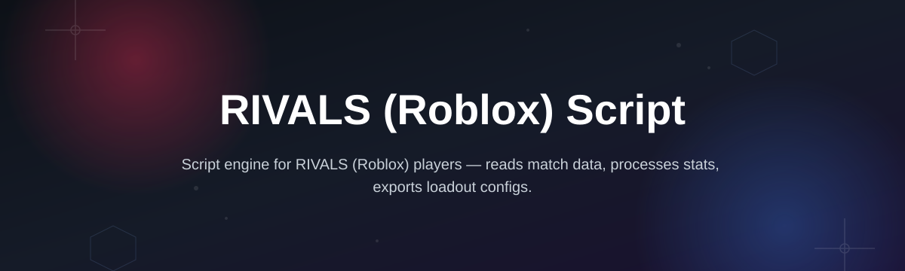
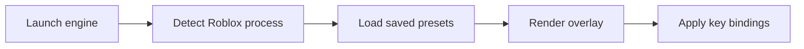

# rivals-script-engine

*A weekend-built control panel for RIVALS (Roblox) Script, made so combat testers stop fighting janky menus instead of the actual game.*

## What this is

rivals-script-engine is a standalone Windows companion for RIVALS (Roblox) Script — the parry-and-block combat game on Roblox. I started this as a personal project because I kept losing track of settings between sessions, rebinding the same keys every time I wanted to test a matchup, and generally fighting the interface more than I was fighting other players. So I built the tool I actually wanted to use.

This isn't a repackaged template or a fork of something else — the UI, the shortcut layer, and the settings persistence were all written from scratch over a handful of weekends. It's a small, focused engine: load it, tune your key bindings and combat presets once, and it stays out of your way after that. If you play or test RIVALS (Roblox) Script often enough to have opinions about its default controls, this is built for you.

  

The button above opens the project's landing page, where you can download the current build.

## Who it is for

- Players who practice RIVALS (Roblox) Script parry timing and want faster, repeatable key binding changes.
- Small Roblox testing crews comparing combat presets across matches.
- Streamers who need a quick on-screen reference for their own keybinds mid-session.
- Tinkerers who like reading how a small Windows tool is put together, not just using it.

## What you can do

- **Rebind every combat key** through a single panel instead of digging through Roblox's own menu.
- **Save named presets** and swap between them in one click for different playstyles.
- **View a live shortcut overlay** while playing, so you're not guessing your own bindings.
- **Import and export your settings** as a plain text file to back them up or share with a friend.
- **Run a lightweight session log** that timestamps when presets were switched, useful for reviewing practice sessions.
- **Auto-detect the running Roblox client** so the engine attaches without manual configuration.
- **Reset to defaults** instantly if a custom preset breaks something.
- **Run fully offline** after the initial download — no background services, no account.

## Getting started

1. Open the landing page using the download button above.
2. Download the latest build listed there.
3. Run the executable — no installer wizard, it launches directly.
4. Set your preferred key bindings in the panel on first launch.
5. Start RIVALS (Roblox) Script and play with the overlay active.

## Requirements

- Windows 10 or Windows 11 (64-bit).
- No toolchain, runtime, or build step needed — it's a standalone executable.
- Roblox client installed and able to run RIVALS (Roblox) Script normally.
- Roughly 40 MB of free disk space for the app and its saved presets.

## How it works

1. The engine starts and scans for an active Roblox process.
2. Your saved presets and bindings load from a local settings file.
3. The overlay renders on top of the game window without altering game files.
4. Key presses route through the engine's binding layer before reaching Roblox.
5. Changes you make save automatically back to your local presets file.

## Keyboard shortcuts reference

| Shortcut | Action | Notes |
|---|---|---|
| `F1` | Toggle overlay visibility | Hides the panel without closing the engine |
| `F2` | Switch to next preset | Cycles through saved presets in order |
| `F3` | Open bindings editor | Opens on top of the current game window |
| `F4` | Save current bindings | Writes to the active preset immediately |
| `F5` | Reset active preset to default | Does not affect other saved presets |
| `Ctrl + S` | Export settings file | Saves a plain text backup to disk |
| `Ctrl + L` | Import settings file | Loads a previously exported file |
| `Esc` | Close any open editor panel | Returns focus to the game window |

## FAQ

**Is this an official RIVALS (Roblox) Script tool?**
No. It's an independent, community-built companion made for players and testers of the game; it isn't affiliated with the game's developers or Roblox.

**Does it modify game files?**
No. It runs alongside the game and overlays a settings panel — it does not touch RIVALS (Roblox) Script's installation or Roblox's own files.

**Can I use this on Mac or Linux?**
Not currently. The engine is built and tested for Windows 10/11 only.

**Will my presets carry over between updates?**
Yes, as long as you keep your exported settings file. Import it after updating and your bindings return.

**Why build this instead of using in-game settings?**
In-game settings reset context every match and don't support named presets or quick switching — this tool adds that layer on top without touching the base game.

## Troubleshooting

- **Overlay doesn't appear over the game window** — run the engine as administrator once, then relaunch normally; this fixes most window-layering issues.
- **Roblox process not detected** — make sure RIVALS (Roblox) Script is already running before you launch the engine, then use `F1` to refresh the overlay.
- **Imported settings file does nothing** — confirm the file wasn't edited outside the engine; malformed text files are ignored silently.
- **Key bindings revert after restart** — check that `Ctrl + S` was used to save before closing; unsaved changes only apply for the current session.

## License

Released under the [MIT License](LICENSE). This project is provided as-is, with no warranty; it is an independent fan-made tool and is not endorsed by the developers of RIVALS (Roblox) Script or by Roblox Corporation.

  

